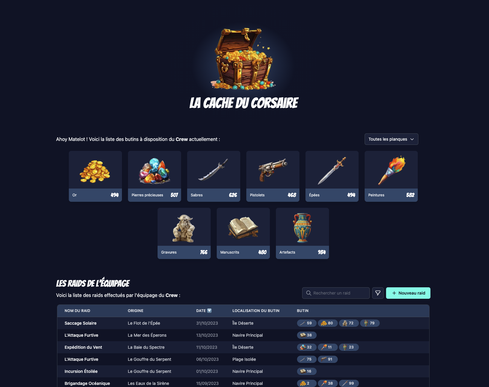

# La cache du Corsaire - Workshop module 3



Bienvenue dans ce workshop de fin de module sur le **Data Fetching**, où vous aurez l'opportunité de consolider et d'appliquer les compétences acquises dans une véritable application moderne. Préparez-vous à plonger dans un projet passionnant et interactif : la gestion d'une cache de **corsaire** !

Dans ce workshop, vous allez développer une application de gestion de **raids** et de **butins** pour un équipage de corsaires. L'application permettra aux utilisateurs de créer, éditer, afficher et supprimer des informations sur les raids, ainsi que de gérer l'inventaire des butins récupérés.

Ce workshop mettra l'accent sur les concepts essentiels du **data fetching** que nous avons abordés dans le module, mais vous permettra également de réviser des concepts du module 2 tels que la manipulation d'états, l'utilisation d'effets, l'écriture de custom hooks.

Préparez-vous à naviguer dans le monde fascinant de la gestion de trésors de corsaires avec React, tout en consolidant vos compétences en développement web !

## Pré-requis

Avant de commencer, vous devez vous assurer que les outils suivants sont installés sur votre machine :

- [Node.js](https://nodejs.org/en/download) (v18.13.0 ou version ultérieure)
- [pnpm](https://pnpm.io/installation) (v8.19.3 ou version ultérieure)

## Lancer le projet

Pour lancer le projet, exécutez la commande suivante :

```bash
pnpm run dev
```

L'application devrait ensuite être accessible à l'adresse http://localhost:5173/.

## Exercices

Le workshop est découpé en exercices. Pour chaque exercice, une branche git correspondante est disponible sur le dépôt. Avant de commencer un nouvel exercice, vous devez donc checkout la branche correspondante.

Exemple : pour accéder à l'exercice 3, exécutez la commande suivante :

```bash
git checkout exercice-3
```

Si vous souhaitez enregistrer votre code entre chaque exercice, vous pouvez forker le dépôt et pousser votre code sur votre propre fork. Sinon, il suffit de revert les modifications avant de checkout l'exercice suivant.

## Besoin d'aide ?

Si vous rencontrez des difficultés pour réaliser les exercices ou si vous avez des questions, n'hésitez pas à demander de l'aide sur le Discord de Coding Crew. Les membres de la communauté seront ravis de vous aider à progresser dans votre apprentissage !
